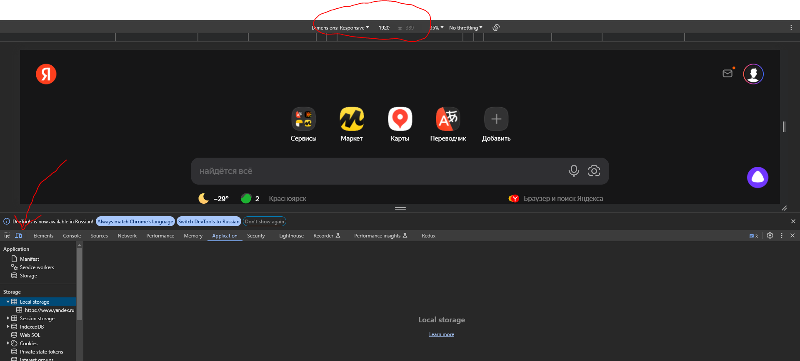
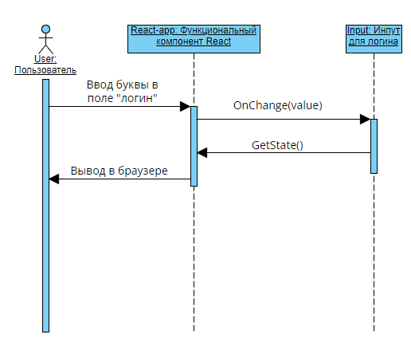
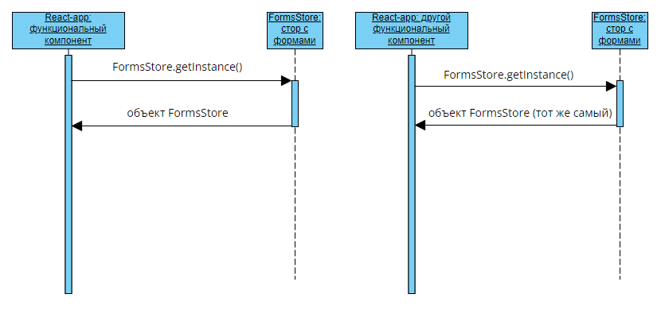
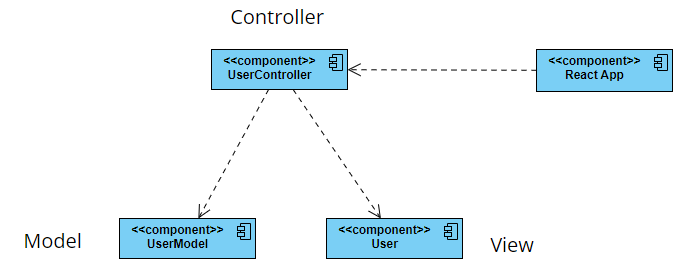
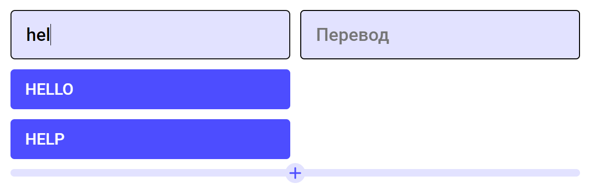

# Быстрый старт данного React приложения

## Вступление
Прежде всего стоит сказать, что данный проект был написан с использованием библиотеки
React и языков программирования JavaScript и TypeScript (второй по сути является надстройкой
над первым, но обычно считается отдельным языком). Код был написан в полуфункциональном стиле 
(в качестве стейтменеджера был использован mobx, который работает на основе ООП, 
а все React-компоненты написаны в функциональном стиле, чтобы была возможность
использовать хуки).

### Расположение файлов mobx (ООП)
Код, который написан с использованием паттернов проектирования (что требуется по заданию)
вы можете найти по пути `...English-platform-TS/src/store` 
### Расположения остальных файлов (Полуфункциональный стиль)
Весь бэкенд для проверки находится по пути `...English-platform-TS/backend` и в 
файле `...English-platform-TS/server.js`

Весь фронтенд для проверки находится по пути `...English-platform-TS/src`

Остальные файлы являются служебными и проверки не подлежат

## Запуск
Для запуска проекта вам понадобится сначала установить NodeJS на свой компьютер.

[Инструкция по установке для Windows](https://www.how2shout.com/how-to/how-to-install-node-js-and-npm-on-windows-10-or-11-using-cmd.html)

Также для вашего удобства я продублирую установку для windows тут: 

1) Открываем консоль CMD (ну или PowerShell)
2) Вводим команду `winget install OpenJS.NodeJS`
3) Если все было установлено успешно, то ПОСЛЕ ПЕРЕЗАПУСКА КОНСОЛИ команда `node -v` выведет текущую версию NodeJS

[Инструкция по установке для Linux](https://upstackhq.com/blog/software-development/how-to-install-node-js-on-linux)

После установки NodeJS вам нужно будет установить все необходимые зависимости для данного проекта.
Для этого открываем консоль и, находясь в директории `...English-platform-TS`, вводим следующую команду:

### `npm install`

После установки зависимостей вы можете запустить проект используя следующую команду в консоли (нужно находиться в директории 
`...English-platform-TS`):

### `npm run dev`

У вас должен был открыться браузер с проектом, если этого не произошло, то сами откройте браузер и перейдите на url
`http://localhost:3000/`.

### Не обязательно (просто для красоты и удобства использования интерфейса)
Так как вы можете запустить проект с разрешения, под которое еще не был адаптирован проект, 
то рекомендуется сменить разрешение на `1920 x 700`, для этого откройте консоль разработчика 
сочетанием клавиш `CTRL + SHIFT + I` и смените разрешение как показано на следующей картинке:

## Объяснение использования паттернов проектирования

### 1) Observer

Начнем с паттерна, который работает "под капотом" mobx. Так как самостоятельная реализация данного
паттерна не логична и затратна по времени (для стейтменеджеров), то во всех из них под капотом уже реализован
данный паттерн. При разработке на реакт используется SPA архитектура (`Single Page Application`), согласно которой
вся страница рендерится один раз. Если же мы захотим изменить что-то на странице(например пользователь вводит что-то
в инпут и нам нужно это отобразить), то здесь нам на помощь приходит данный паттерн. Под капотом он отслеживает изменение
состояний (в нашем случае у объекта меняются поля) и компонент перерисовывается (не вся страница, а только компонент, к 
которому был привязан наш объект). Простейший пример работы можно изобразить при помощи следующей sequence uml-диаграммы:

### 2) Singleton

Данный паттерн абсолютно всегда используется при работе с mobx, так как у нас есть так называемый(ые) `store-объект(ы)` 
(сторы/хранилища), которые важно чтобы использовались в единственном экземпляре во всем нашем приложении (например FormsStore
содержит в себе все формы и методы для работы с ними. Также при помощи паттерна observer отслеживаются все изменения в нашем сторе).
Показать применение этого паттерна проще всего при помощи двух `Sequence UML` диаграмм:

На них видно, что у нас есть необходимость использования одного и того же стора во всей программе (то есть если мы где-то
изменили стор, то он уже измененный доступен во всей программе)

### 3) MVC (Model-View-Controller)

Данный паттерн заключается в разделении нашего приложения на 3 составных части - модели, контроллеры, видимая часть(view в нашем случае
это данные, которые пришли с сервера и отображаются на странице). Согласно данному паттерну на бэкенд-части запросы к базе данных
были разделены на модели (структуры представления данных) и контроллеры (отвечают уже за сам запрос к БД). После выполения работы 
контроллера данные попадают уже в наш store, который по сути и является view-частью. Пользователь увидит обновленные компоненты
с данными на странице. Реализация хорошо заметна на `UML Component` диавграмме (показан пример с пользователем):

### Какок паттерн абсолютно не подходит?

На самом деле здесь можно про любой оставшийся паттерн сказать, что он не подходит по той или иной причине,
но например рассмотрим паттерн `flyWeight`, потому что здесь объяснение неприемлимости использования будет наиболее логично выглядеть.
Его использование необходимо уже в огромных системах, где ощущается нехватка ресурсов сервера/устройства пользователя и у нас
множество объектов, использующих одни и те же данные. У нас же система очень маленькая и такого не может наблюдаться, поэтому
и его использование будет избыточно. Повторюсь, что так же можно рассуждать и про остальные паттерны, но рассмотрел я только один.

## Просмотр функционала

В данном веб-приложении реализован не весь функционал, поэтому здесь даны подсказки по тому, что уже можно просматривать и 
использовать:

### 1) Регистрация и вход

Если вы нажмете на любую кнопку на верхней панели (в хэдере), то если вы не авторизированы, вас перекинет обратно на главную
и появится форма для входа и регистрации (если у вас нестабильное интернет-соединение, то придется подождать, это может быть не
понятно, так как еще не был добавлен загрузочный экран).

### 2) Создание модулей и автодополнение слов при создании модуля

В верхней панели после входа выберите пункт `Модули` и здесь нажмите на значок для добавления модуля.
Когда вы будете вводить слова слева, то будут выводиться подсказки для заполнения. Пока для тестовой версии в 
базе данных всего 3 слова: `hello - привет, здарова`, `okay - окей`, `help - помощь`. То есть в левый инпут если вы введете часть
слова, например `hel`, то у вас в подсказках появятся `hello` и `help`, что видно на скриншоте:

Опять же важно иметь стабильное подключение, потому что для тестовой версии нет загрузочных экранов и вам может быть не понятно, 
что данные загружаются с сервера долго из-за плохого соединения. Так же будет видно и автозаполнение перевода.

### 3) Тренировка-заучивание

В верхней панели выберите раздел `Тренировки` и выберите тренировку-заучивание. После чего выберите ранее созданный вами
модуль и пройдите тренировку, после чего вы увидите ваш результат.

---
Остальной функционал не доделан и поэтому в остальные разделы вы можете не переходить.

